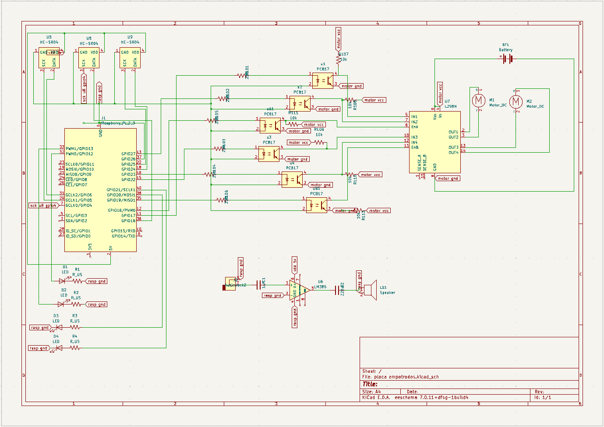

## Descripción

En la siguiente imagen se muestra el diseño del aislamiento galvánico entre la etapa
de potencia y la etapa lógica del sistema.

## Esquemático

## Separación de dominios eléctricos

### Dominio lógico

En esta parte del circuito se encuentran los 3 sensores, los 4 LEDs y el amplificador,
ya que estos componentes funcionan dentro de los niveles de tensión manejados por la
Raspberry Pi 4.

### Dominio de potencia

En esta sección se encuentran los motores destinados al movimiento del robot, junto
con el módulo L298N encargado de controlarlos mediante señales de dirección y PWM.

## Aislamiento galvánico

Se utilizaron optoacopladores para aislar eléctricamente las señales provenientes de
la Raspberry Pi de la etapa de potencia. De esta manera, no existe una conexión
eléctrica directa entre los GPIO de la Raspberry Pi y las entradas de control del
L298N.

## Alimentación del puente H

El módulo L298N es alimentado directamente desde la batería destinada a la etapa de
potencia, de manera independiente de la alimentación de la Raspberry Pi.

## Separación de tierras

La tierra del dominio lógico y la tierra del dominio de potencia se mantienen
separadas. La transferencia de las señales de control entre ambos dominios se realiza
mediante los optoacopladores, manteniendo el aislamiento galvánico.

## Revisión del diseño

- [ ] Revisión 1:
- [ ] Revisión 2:

## Criterios de aceptación

- [x] Dos dominios eléctricos claramente separados: lógica y potencia.
- [x] Optoacopladores interpuestos entre las señales PWM/dirección y el puente H.
- [x] Puente H alimentado de forma independiente del riel lógico.
- [x] Tierras de ambos dominios separadas.
- [x] Esquema revisado y aprobado por al menos dos integrantes.
