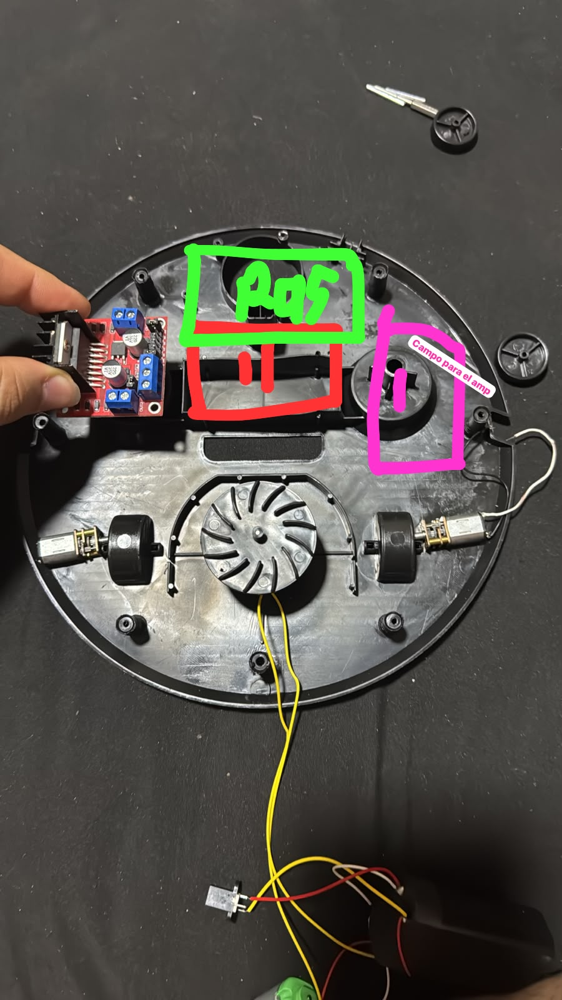

## Descripción

Se documenta la decisión de reutilizar el chasis de una aspiradora robótica genérica
(tipo Roomba) como base física del robot, en lugar de diseñar y fabricar un chasis
propio desde cero.

## Referencia física

Vista inferior de la carcasa reutilizada. Se identifican las zonas reservadas para la
Raspberry Pi ("RPI"), el compartimiento debajo de esa zona, y el espacio para el
amplificador ("Campo para el amp"), además del módulo de aspirado (ventilador/impulsor
central) y los dos motores de tracción a los costados, cada uno acoplado a su rueda
mediante una banda/correa -- no por acople directo de eje.

## Componentes reutilizados de la aspiradora original

### Carcasa (case)

Se reutiliza la carcasa original como estructura de montaje del robot, aprovechando
que ya resuelve la sujeción de componentes y la estética del rubro de evaluación del
modelo físico.

### Módulo de aspirado

Se reutiliza el módulo de aspirado original (motor de succión + mecanismo) en lugar
de construir uno propio, y se controla desde `librobot.so` mediante las funciones
`vacuum_on()`/`vacuum_off()` ya definidas en `librobot.h`.

### Ruedas

Se reutilizan las ruedas de tracción originales de la aspiradora, montadas ahora sobre
los motores DC propios del proyecto (ver más abajo).

## Componentes NO reutilizados

### Motores de tracción originales

Los motores de tracción propios de la aspiradora no se reutilizan. Motivo confirmado:
en el diseño original, el único motor asociado a una rueda estaba en la "rueda loca"
(caster), y su función era simplemente hacerla girar sobre sí misma (un rodillo libre,
sin relación con tracción diferencial) -- no existía un segundo motor de tracción real
como el que necesita este proyecto. Al no calzar con el esquema de dos ruedas
motorizadas independientes + una rueda loca de apoyo que pide US-101, se descartan los
motores originales y se reemplazan por los M1/M2 propios.

## Componentes propios a integrar (según esquemático de US-101)

El resto del robot se implementa con los componentes ya definidos en el esquemático de
aislamiento galvánico (ADR-001):

- Dos motores DC (M1, M2) controlados vía L298N (U7) y optoacopladores, en reemplazo
  de los motores originales de la aspiradora.
- Tres sensores ultrasónicos HC-SR04* (U5, U8, U9) para detección de obstáculos.
- Cuatro LEDs de estado (D1-D4).
- Parlante, amplificador LM386* (U6) y jack de audio 3.5mm (J2, LS1) para las
  notificaciones sonoras.
- Batería (BT1) y Raspberry Pi 4 (J1).

*El modelo de los componentes puede cambiar en el transcurso del proyecto debido a dimensiones o comportamientos innesperados.

## Control de tracción (M1/M2 vía L298N)

Los dos motores de tracción visibles en la foto son los que corresponden a M1/M2 del
esquemático de US-101, cada uno acoplado a su rueda por eje directo). El módulo mostrado 
en la foto es un driver L298N tipo "breakout" (PCB roja con disipador y bornes azules), 
el mismo U7 del esquemático.

## Consideraciones y contingencias

- **Velocidad variable por PWM.** Confirmado por el equipo como requisito de diseño:
  los motores de tracción deben soportar velocidad variable, por lo que al integrar
  el módulo L298N hay que verificar físicamente que los jumpers de fábrica en
  ENA/ENB (si el módulo los trae) estén retirados -- de lo contrario el PWM de
  `motor_set_speed()` no tendría efecto sobre la velocidad real del motor.
- **Especificación del motor de aspirado reutilizado.** Para dimensionar correctamente
  la etapa de switcheo (MOSFET + optoacoplador) que va a controlar este motor desde
  `librobot.so`, hace falta confirmar su voltaje y corriente de operación reales
  (suelen no venir marcados en el motor y hay que medirlos o inferirlos del pack
  original de la aspiradora).

